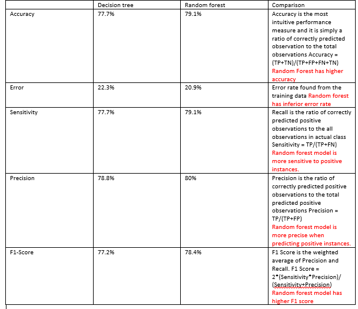

# Jewelry-Price-Prediction

We have developed this model to accurately predict jewelry prices with a remarkable 80% level of accuracy. This model serves as an invaluable tool for website owners, empowering them to establish optimal price points for their potential products. Moreover, it provides customers with valuable insights into the pricing of customized jewelry pieces, allowing them to make informed decisions.

<H1>Project Overview:</H1>
<ol>
  <li>Scraped 780 jewelery Products. </li>
  <li>Cleaned and Preprocessed Data. </li>
  <li>EDA. </li>
  <li>Feature Selection. </li>
  <li>Models Building: Decision Tree, Linear Discriminant Analysis, Support Vector Machine, Random Forest. </li>
</ol>

<H1>Data Preprocessing and Cleaning : </H1>
<h3><u>Handle missing data:</u></h3>

We identified the presence of missing values in both the price and weight variables. 
  To ensure data integrity, we employed a robust data cleaning approach. Specifically, we replaced these missing values with the mean values of their respective variables.

<h3><u>Fix structural errors by creating categories:</u></h3>

The “article_name” column contains some inconsistent words and expressions so we 
organize the data by creating types which are mainly 7: Earrings, necklaces,rings, pendant, bracelet.

<h3><u>Outliers detection and removal :</u></h3>
In order to have an idea about the outliers in our data set we chose boxplots and scatter 
plots as visulization tools.
 In order to detect the values of outliers we performed z-score analysis. 
 We set threshold = 3 ie : we defined outliers as points situated at 3 standard deviations around 
the mean. Prices in range [1700,7000] are considered outliers and were removed.

<h3><u>Feature Selection : </u></h3>
Is the process of reducing the number of input variables when developing a predictive model. 
It is desirable to reduce the number of input variables to, in our casee, improve the 
performance of the model.
 
<h4> First Approach: Univariate analysis : CHI2 TEST: </h4>
We performed the Chi2 test to know which features are significant.
<ul>
  <li>Assign ‘’Fail to reject’’ to features with no significance </li>
  <li>Assign ‘’Reject null hypthesis’’ to features with significance </li>
  
</ul>
  Results showed that all features are significant.

<h4> Second Approach: Testing correlation between features: </h4>
 We used LabelEncoder from sklearn.preprocessing to transform categorical 
values into float values.
  We used sns.heatmap to visualize the correlation between features. 
We removed features that have correlation more than 0.9.

<h4> Performing the Backward elimination: </h4>
In backward elimination, we start with the full model (including all the independent 
variables) and then remove the insignificant feature with the highest p-value(> significance 
level). This process repeats again and again until we have the final set of significant features.

<ol>
  <li>Choose a significance level (e.g. SL = 0.05 with a 95% confidence).</li>
  <li>Fit a full model including all the features.</li>
  <li>Consider the feature with the highest p-value. If the p-value > significance level then 
  go to Step 4, otherwise terminate the process.</li>
  <li> Remove the feature which is under consideration.</li>
  <li>Fit a model without this feature. Repeat the entire process from Step 3.</li>
</ol>

<H1>Building Models: </H1>

<H4>Random Forest: </H4>
Random Forest is a powerful supervised learning algorithm that enhances predictive capabilities by utilizing the concept of ensemble learning. It achieves this by constructing a multitude of decision trees, referred to as estimators. The parameter "n_estimator" represents the number of trees to be built before aggregating the predictions through techniques such as maximum voting or averaging. In our specific case, we have opted for a value of 100 for n_estimator.
 
The rationale behind selecting the Random Forest algorithm stems from its versatility and numerous advantages. Notably, Random Forest exhibits robustness across a wide range of applications and data scenarios. Moreover, it provides valuable insights into feature importance, which aids in comprehending the relative significance of various input variables in predicting the target variable. This information can be leveraged to gain deeper insights into the underlying relationships within the dataset and inform subsequent decision-making processes.

<H1>Model Performance: </H1>

